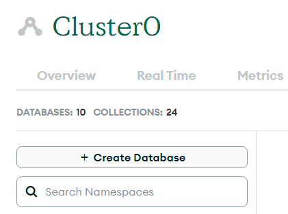
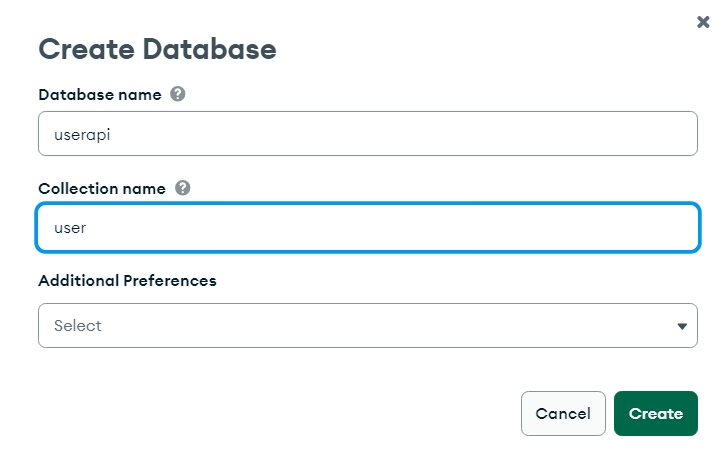

Sure! Here is the updated tutorial with more detailed explanations, comments in the code, and advanced password validation:

---

# Renton Technical College CSI-244

<div align="center">  
    
    <h3 align="center">Guided Activity 7</h3>
</div>

This repository is a part of CSI-244 at Renton Technical College.

## Guided Activity 7 User Authentication API

### This tutorial is adapted from: 

O, L. (2022, July 8). How to Build an Authentication API with Node.js, MongoDB, and JWT. Medium; Medium. https://medium.com/@olills/how-to-build-a-node-js-api-server-with-jwt-authentication-113fa55708d7

‌

### In this tutorial you will be creating a RESTful API for user Authentication using the MVC pattern.

1. Clone this repository to your machine.
2. Open the repository in Visual Studio code.
3. Follow the instructions to create a RESTful API using mongoose and MVC.

# Part 1: Setting up the Environment

We begin by creating a new directory for our project and initializing a Node.js project. We'll also install the necessary packages.

```bash
mkdir screenshots
mkdir userapi
cd userapi
npm init -y
npm install express mongoose cors
```

### Why Use Environment Variables?

To enhance the security and flexibility of your application, it's a best practice to move sensitive information, such as your database connection string, into environment variables. This can be achieved using a `.env` file in your Node.js project. Here's how to set it up:

### Step 1: Create a Mongo Collection for this application

1. Navigate to [MongoDB Atlas](https://www.mongodb.com/cloud/atlas) and log in.
2. Click on collections and create a new database called `userapi`.



3. Create a new collection called `user`.



### Step 2: Install dotenv Package

First, you'll need to install the `dotenv` package, which will load environment variables from a `.env` file into `process.env` in your application. Run the following command in your project directory:

```powershell
npm install dotenv
```

### Step 3: Create a .env File

1. In the root of your project directory, create a file named `.env`.
2. Open the `.env` file in VS Code.
3. Add your MongoDB connection string and token secret as environment variables in the file. For example:

```env
MONGO_URI=YOUR_CONNECTION_STRING_HERE
TOKEN_SECRET=YOUR_RANDOM_SECRET_KEY_HERE
```

Replace `YOUR_CONNECTION_STRING_HERE` with your actual MongoDB connection string and `YOUR_RANDOM_SECRET_KEY_HERE` with a randomly generated secret key.

### Step 4: Ensure .env is in Your .gitignore

To prevent sensitive information from being pushed to your Git repository, make sure your `.env` file is listed in your `.gitignore` file. If you don't have a `.gitignore` file, create one in the root of your project, and add the following lines:

```
.env
node_modules/
```

By moving your MongoDB connection string into an `.env` file and utilizing the `dotenv` package, you enhance the security and configurability of your application, keeping sensitive information out of your codebase.

# Part 2: Building the Application

Create a new file named `server.js` in the root folder of `userapi`.

```powershell
new-item server.js
```

Add a simple console.log statement to `server.js` to verify it is working, and run `server.js`:

```powershell
node server.js
```

Modify `server.js` to include the following code:

```javascript
const express = require("express");
const app = express();
app.listen(3000, () => console.log("Server is up and running"));
```

### Step 1: Setting up HTTP routes

In the root of the project directory, create a new folder `routes`.

Within the `routes` folder, create a new file `userRoutes.js`.

Inside `userRoutes.js`, create POST routes to enable users to register and login:

```javascript
const router = require("express").Router();
const userController = require("../controllers/userController");

// Define the routes for user registration and login
router.post("/register", userController.register);
router.post("/login", userController.login);

module.exports = router;
```

### Explanation

- We define two routes, `/register` and `/login`, and connect them to the respective controller functions in `userController`.
- `userController` handles the actual logic for registration and login.

### Step 2: Creating the User Controller

In the root of the project directory, create a new folder `controllers`.

Within the `controllers` folder, create a new file `userController.js`.

Inside `userController.js`, implement the controller functions for registering and logging in users:

```javascript
const User = require("../models/User");
const bcrypt = require("bcrypt");
const jwt = require("jsonwebtoken");

// Controller function for user registration
exports.register = async (req, res) => {
  try {
    // Check if the email already exists in the database
    const emailExist = await User.findOne({ email: req.body.email });
    if (emailExist) return res.status(400).send("Email already exists");

    // Hash the user's password
    const salt = await bcrypt.genSalt(10);
    const hashedPassword = await bcrypt.hash(req.body.password, salt);

    // Create a new user
    const user = new User({
      name: req.body.name,
      email: req.body.email,
      password: hashedPassword,
    });

    // Save the user to the database
    const savedUser = await user.save();
    res.send({ user: user._id });
  } catch (err) {
    res.status(400).send(err);
  }
};

// Controller function for user login
exports.login = async (req, res) => {
  try {
    // Check if the email exists in the database
    const user = await User.findOne({ email: req.body.email });
    if (!user) return res.status(400).send("Email not found");

    // Validate the user's password
    const validPassword = await bcrypt.compare(req.body.password, user.password);
    if (!validPassword) return res.status(400).send("Invalid password");

    // Create and assign a JWT token
    const token = jwt.sign({ _id: user._id }, process.env.TOKEN_SECRET);
    res.header("auth-token", token).send(token);
  } catch (err) {
    res.status(400).send(err);
  }
};
```

### Explanation

- The `register` function checks if the email already exists, hashes the password, and creates a new user in the database.
- The `login` function checks if the email exists, validates the password, and assigns a JWT token if the login is successful.

### Step 3: Adding the routes to the server

Inside `server.js`, import the user routes and add middleware:

```javascript
const express = require("express");
const app = express();
const mongoose = require("mongoose");
const dotenv = require("dotenv");

dotenv.config();

// Import routes
const userRoutes = require("./routes/userRoutes");

// Connect to DB
mongoose.connect(
  process.env.MONGO_URI,
  { useNewUrlParser: true, useUnifiedTopology: true }
);

// Middleware to parse JSON requests
app.use(express.json());

// Route middlewares
app.use("/api/user", userRoutes);

app.listen(3000, () => console.log("Server is up and running"));
```

### Explanation

- We import the necessary packages and configure the environment variables.
- We connect to the MongoDB database using Mongoose.
- We set up middleware to parse JSON requests.
- We define the route middleware to handle requests to `/api/user`.

### Step 4: Creating the User Model

In the root of the project directory, create a new folder `models`.

Within the `models` folder, create a new file `User.js`.

Inside `User.js`, create a new schema for the user model with validation:

```javascript
const mongoose = require("mongoose");

const userSchema = new mongoose.Schema({
  name: {
    type: String,
    required: true,
    minlength: 2,
  },
  email: {
    type: String,
    required: true,
    minlength: 4,
    unique: true,
  },
  password: {
    type: String,
    required: true,
    minlength: 6,
    validate: {
      validator: function (v) {
        return /^(?=.*\d)(?=.*[a-z])(?=.*[A-Z])(?=.*\W).{6,}$/.test(v);
      },
      message: props => `${props.value} is not a valid password!`
    }
  },
  date: {
    type: Date,
    default: Date.now,
  },
});

module.exports = mongoose.model("User", userSchema);
```

### Explanation

- We define a schema for the user model with validation.
- The `name` and `email` fields are required and have minimum length requirements.
- The `password` field is required and must contain at least one digit, one lowercase letter, one uppercase letter, and one special character.
- The `date` field is automatically set to the current date when a new user is created.

### Step 5: Protecting Routes

To protect routes, we'll create a middleware to verify the token.

Create a new file `verifyToken.js` in the root directory.

```javascript
const jwt = require("jsonwebtoken");


module.exports = function (req, res, next) {
  // Get the token from the request header
  const token = req.header("auth-token");
  if (!token) return res.status(401).send("Access denied");

  try {
    // Verify the token
    const verified = jwt.verify(token, process.env.TOKEN_SECRET);
    req.user = verified;
    next();
  } catch (err) {
    res.status(400).send("Invalid token");
  }
};
```

### Explanation

- The `verifyToken` middleware extracts the token from the request header and verifies it using the secret key.
- If the token is valid, the user information is added to the request object, and the next middleware is called.
- If the token is invalid or missing, an error message is sent.

### Step 6: Creating a Protected Route

In the `routes` folder, create a new file `postsRoutes.js`.

```javascript
const router = require("express").Router();
const verify = require("../verifyToken");

// Protected route to get user information
router.get("/", verify, (req, res) => {
  res.send(req.user);
});

module.exports = router;
```

### Explanation

- We create a protected route that uses the `verifyToken` middleware to ensure only authenticated users can access it.
- The route sends back the user information if the token is valid.

Import `postsRoutes` into `server.js` and set up the middleware:

```javascript
const express = require("express");
const app = express();
const mongoose = require("mongoose");
const dotenv = require("dotenv");

// Import Routes
const userRoutes = require("./routes/userRoutes");
const postRoutes = require("./routes/postsRoutes");

dotenv.config();

// Connect to DB
mongoose.connect(
  process.env.MONGO_URI,
  { useNewUrlParser: true, useUnifiedTopology: true }
);

// Middleware to parse JSON requests
app.use(express.json());

// Route Middlewares
app.use("/api/user", userRoutes);
app.use("/api/posts", postRoutes);

app.listen(3000, () => console.log("Server is up and running"));
```

### Explanation

- We import and configure the routes for handling user and post-related requests.
- We set up middleware to handle JSON requests and protect routes with the `verifyToken` middleware.

### Step 7: Testing the API

Using Postman, you can now test the following:

1. Register a new user via `/api/user/register`.
2. Login via `/api/user/login` to receive a JWT.
3. Access the protected route `/api/posts` using the JWT as an `auth-token` header.

Take screenshots of the results and add them to your repository.

### Summary

We have created a REST API for user registration and authentication using the MVC pattern. This includes setting up the server with Express, connecting to MongoDB with Mongoose, and securing routes with JWTs. The advanced password validation ensures users create strong passwords, enhancing the security of your application.
